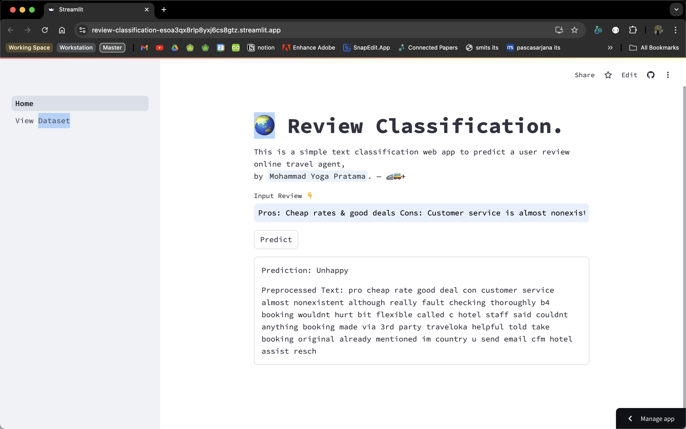

## Cara Menjalankan Proyek
1. Clone repository ini ke lokal Anda:
    ```bash
    git clone https://github.com/mpratama17/review-classification.git
    ```
    ```bash
    cd review-classification
    code .
    ```
2. Install requirement.txt
   ```bash
     pip install requirement.txt
    ```
4. Jalankan app.py pada terminal VSCODE
   ```bash
   streamlit run app.py
   ```

## Screenshot
Berikut adalah tampilan web app:
<!-- Atau menggunakan kode HTML -->
 
  
